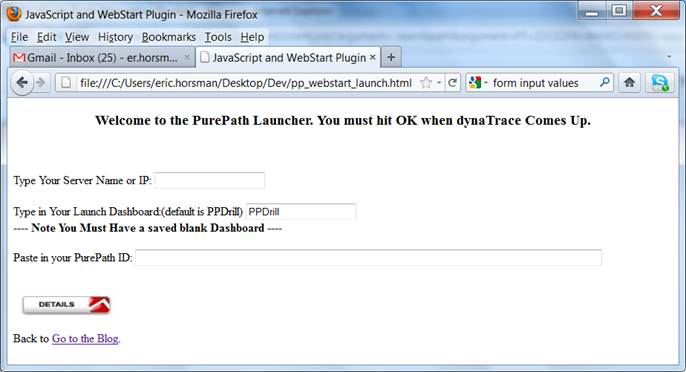
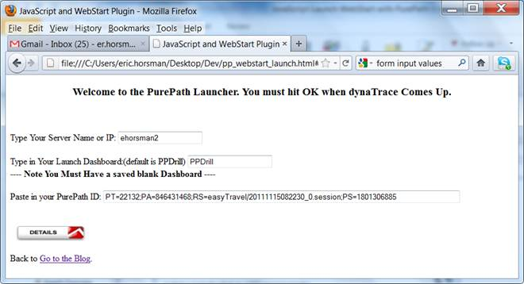
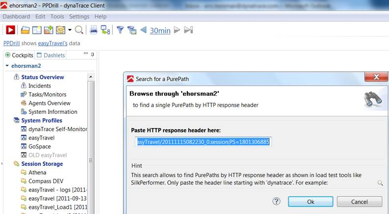
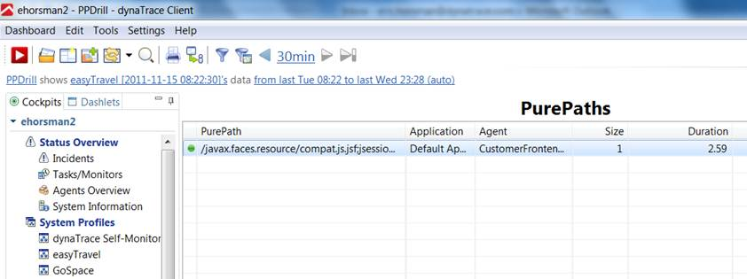

<html xmlns="http://www.w3.org/1999/xhtml">
<head>
    <title>PurePath WebStart Launcher</title>
    <meta http-equiv="Content-Type" content="text/html; charset=UTF-8"/>
    <meta http-equiv="X-UA-Compatible" content="IE=EmulateIE8" />
    <meta content="Scroll Wiki Publisher" name="generator"/>
    <link type="text/css" rel="stylesheet" href="css/blueprint/liquid.css" media="screen, projection"/>
    <link type="text/css" rel="stylesheet" href="css/blueprint/print.css" media="print"/>
    <link type="text/css" rel="stylesheet" href="css/content-style.css" media="screen, projection, print"/>
    <link type="text/css" rel="stylesheet" href="css/screen.css" media="screen, projection"/>
    <link type="text/css" rel="stylesheet" href="css/print.css" media="print"/>
</head>
<body>
                <h1>PurePath WebStart Launcher</h1>
    

        <h2>Overview</h2>
    

        <table>
<thead class=" "></thead><tfoot class=" "></tfoot><tbody class=" ">    <tr>
            <td rowspan="1" colspan="1">
        

Name    

            </td>
                <td rowspan="1" colspan="1">
        

<strong class=" ">PurePath WebStart Launcher</strong>    

            </td>
        </tr>
    <tr>
            <td rowspan="1" colspan="1">
        

Description    

            </td>
                <td rowspan="1" colspan="1">
        

This website allows you to launch the WebStart client and open a specific PurePath identified by its ID.    

            </td>
        </tr>
    <tr>
            <td rowspan="1" colspan="1">
        

Author    

            </td>
                <td rowspan="1" colspan="1">
        

<a href="mailto:eric.horsman@dynatrace.com">Eric Horsman</a>, <a href="mailto:asad.ali@dynatrace.com">Asad Ali</a>    

            </td>
        </tr>
    <tr>
            <td rowspan="1" colspan="1">
        

Version    

            </td>
                <td rowspan="1" colspan="1">
        

1.0    

            </td>
        </tr>
    <tr>
            <td rowspan="1" colspan="1">
        

Support    

            </td>
                <td rowspan="1" colspan="1">
        

<a href="https://community/display/DL/Support+Levels#SupportLevels-Community">Not Supported </a>    

            </td>
        </tr>
    <tr>
            <td rowspan="1" colspan="1">
        

Download    

            </td>
                <td rowspan="1" colspan="1">
        

<a href="attachments_63963150_1_PP_WebStart_Launcher.zip">PurePath WebStart Launcher</a> <a href="attachments_63963160_1_PPDrill.dashboard.xml">PPDrill Dashboard</a>    

            </td>
        </tr>
</tbody>        </table>
            

    

    

        <h2>Tool Information</h2>
    

This launcher consists of a website that allows you to enter a PurePath ID, launches the dynaTrace client and opens the specified PurePath.    

    

    

        <h2>Installation</h2>
    

        

    

    

<ol class=" "><li class=" ">    

Download <a href="attachments_63963160_1_PPDrill.dashboard.xml">PPDrill Dashboard</a> and import it into your dynaTrace server.    

</li><li class=" ">    

Download the <a href="attachments_63963150_1_PP_WebStart_Launcher.zip">PurePath WebStart Launcher ZIP File</a> and unzip it to a location of your choice.    

</li><li class=" ">    

Open PP_WebStart_Launch.html    

</li><li class=" ">    

To use the PurePath Launcher, you need to specify your dynaTrace server name or IP, as well as a Dashboard that will be opened on startup. The dashboard can also be empty, and we suggest to create an empty &quot;PPDrill&quot; dashboard.    

</li><li class=" ">    

Just paste your PurePath ID into the appropriate field and click the &quot;details&quot; button. This will start the WebStart client and display the &quot;Search for a PurePath&quot; dialog, already pre-filled with the specified PurePath ID. Click OK to search for the PurePath.    

</li></ol>    

    

        <h2>Screenshots</h2>
    

    

    

        <table>
<thead class=" "></thead><tfoot class=" "></tfoot><tbody class=" ">    <tr>
            <td rowspan="1" colspan="1">
        

            
            

            </td>
                <td rowspan="1" colspan="1">
        

            
            

            </td>
                <td rowspan="1" colspan="1">
        

            
            

            </td>
                <td rowspan="1" colspan="1">
        

            
            

            </td>
        </tr>
    <tr>
            <td rowspan="1" colspan="1">
        

View on start (not configured)    

            </td>
                <td rowspan="1" colspan="1">
        

Server, dashboard and PurePath ID specified    

            </td>
                <td rowspan="1" colspan="1">
        

dynaTrace WebStart client - Search for a PurePath dialog    

            </td>
                <td rowspan="1" colspan="1">
        

Singe PurePath in PPDrill dashboard    

            </td>
        </tr>
</tbody>        </table>
            

    

            

        

        

        

    

</body>
</html>
